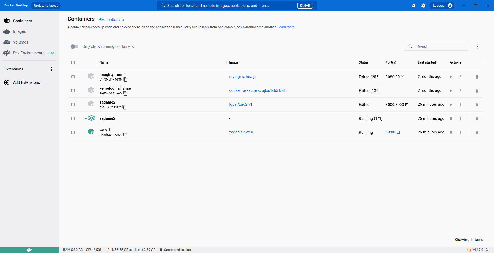
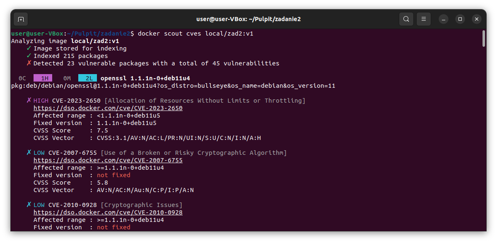
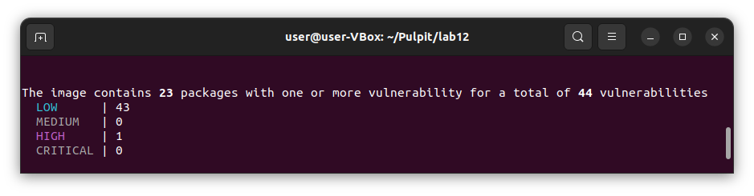
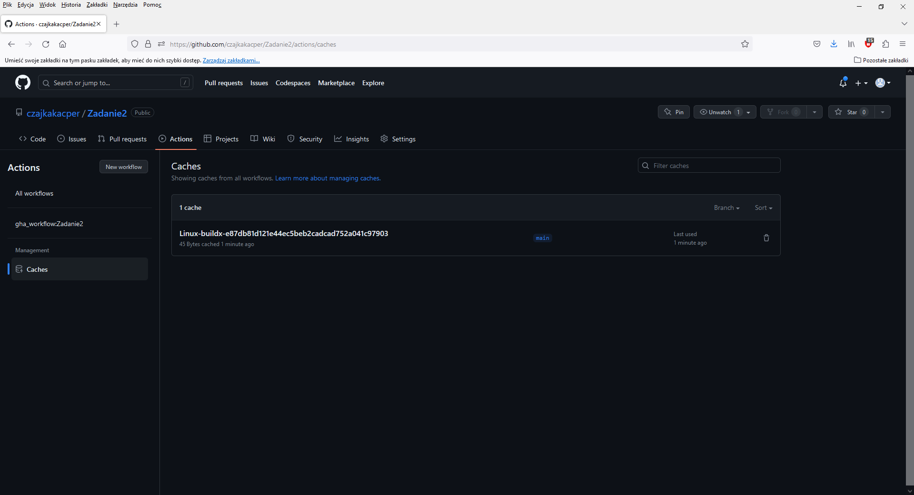
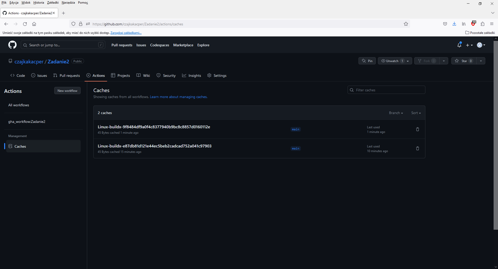
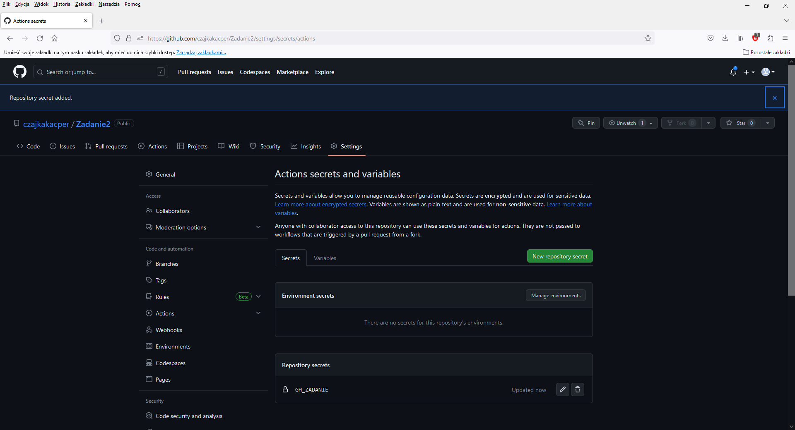
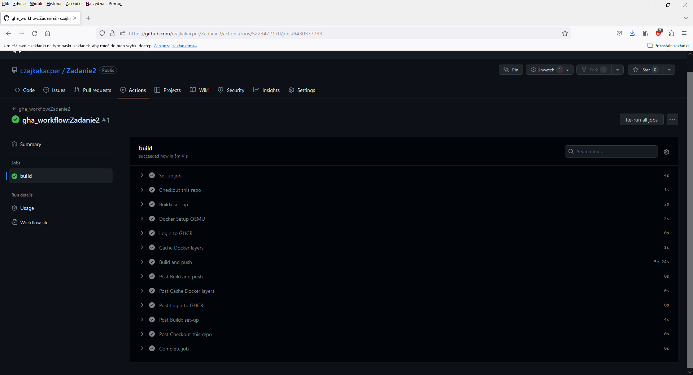
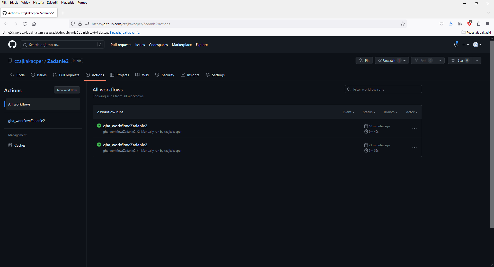
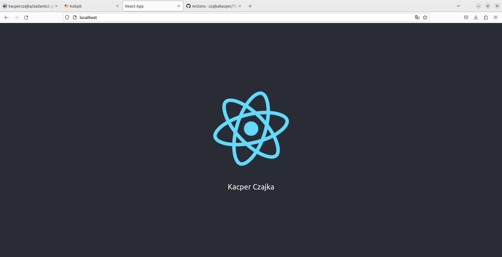
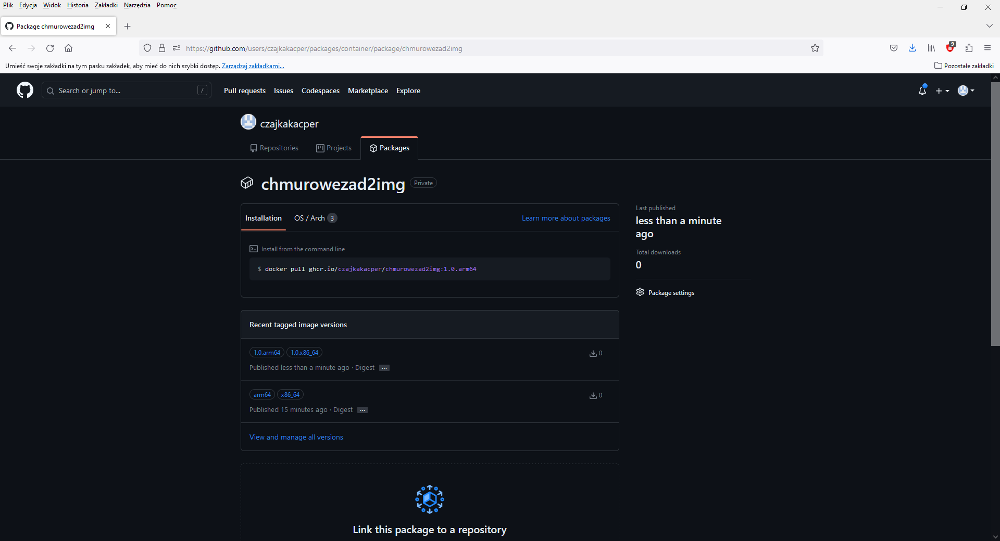

# Zadanie 2 - Obowiązkowe

Użyte polecenia: 
1. Zastosowanie docker build:
    ```
    docker build -f Dockerfile -t local/zad2:v1 .
    ```
2. Zastosowanie docker compose:
    ```
    docker compose -f docker-compose.yml up -d --build
    ```
3. Uruchomienie usługi(wykorzystanie wolumenów):
    ```
    docker run -it -p 3000:3000 --name zadanie2 -v /app/node_modules -v $(pwd):/app local/zad2:v1
    ```
    ![image](screeny/
4. Poddanie obrazu testowi pod kątem CVE z wykorzystaniem dowolnego narzędzia przedstawionego na laboratorium:
    ```
    docker scout cves local/zadanie2:v1
    ```
5. Adres strony bazowej React z imieniem i nazwiskiem znajduję się pod poniższym adresem:
     ```
     http://localhost:80/
     ```

# Część dodatkowa

W części dodatkowej zadania zmodyfikowałem plik gha_workflow.yml:
1. Dodałem deklaracje zmiennych, które przechowywują numer wersji, dodałem je prze sekcją 'jobs':
    ```
    env: 
        MAJOR_VERSION: 1 
        MINOR_VERSION: 0
    ```
2. Aktualizacja tagów obrazu w sekcji 'tags':
    ```
    tags: |
       ghcr.io/${{ github.repository_owner }}/zadanie2img:${{ env.MAJOR_VERSION }}.${{ env.MINOR_VERSION }}.x86_64
       ghcr.io/${{ github.repository_owner }}/zadanie2img:${{ env.MAJOR_VERSION }}.${{ env.MINOR_VERSION }}.arm64
    ```
4. Inkrementacja numeru wersji:
    ```
   - name: Increment version
        run: |
            MAJOR_VERSION=$(echo $MAJOR_VERSION | awk -F"." '{print $1}')
            MINOR_VERSION=$(echo $MINOR_VERSION | awk -F"." '{print $1}')
            MAJOR_VERSION=$((MAJOR_VERSION + 1))
            MINOR_VERSION=$((MINOR_VERSION + 1))
            sed -i "s/MAJOR_VERSION=.*/MAJOR_VERSION=$MAJOR_VERSION/" $GITHUB_ENV
            sed -i "s/MINOR_VERSION=.*/MINOR_VERSION=$MINOR_VERSION/" $GITHUB_ENV
     ```


W Folderze 'screens' znajdują się udkomentowane zrzuty ekranu z poszczególnych etapów zadania: <br><br>
Docker_Desktop.png - Wynik z Docker Desktopa z utworzonym kontenerem z zadania <br>
<br>
Docker_scout.png - Wynik z użytego polecenia ` docker scout cves local/zadanie2:v1 ` <br>

Docker_scout_wynik.png - Wynik z użytego polecenia powyżej oraz wyniki zagrożeń(brak zagrożeń krytycznych) <br>

github_cache.png - Wynik z Cache z Github Action <br>

github_cache_dodatkowe.png - Wynik z Cache z Github Action po wykonaniu zadania dodatkowego <br>

Gitub_Token.png - Dodawanie wygenerowanego Tokenu do repozytorium <br>

github_workflow.png - Wynik z Actions workflow <br>

github_workflow_dodatkowe.png - Wynik z Actions workflow z dodatkowego zadania <br>
 
React_przegladarka.png - Wynik z przegladarki po adresem http://localhost:80/ <br>

Tagowanie_obrazu.png - Wynik z Prackages z podstawowego i dodatkowego zadania <br>



